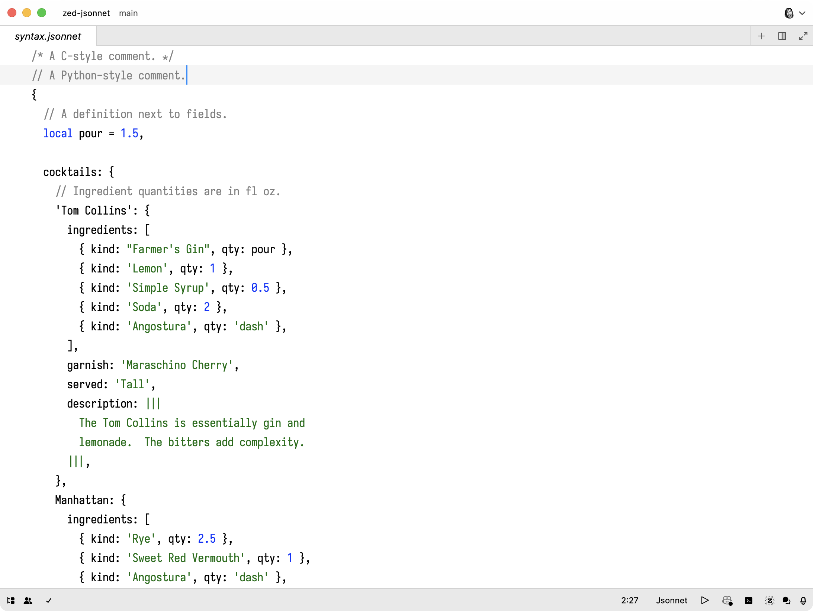

# zed-jsonnet

[Jsonnet][1] language support for [Zed][2] editor.

## Related Projects

- [tree-sitter-jsonnet](https://github.com/sourcegraph/tree-sitter-jsonnet)
- [jsonnet-language-server](https://github.com/grafana/jsonnet-language-server)

[1]: https://jsonnet.org/
[2]: https://zed.dev/
